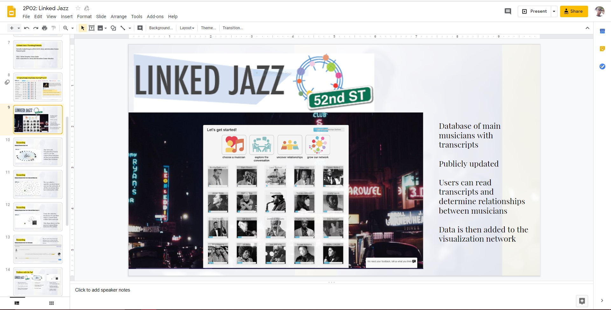

# IASC-2P02 | Austin Holierhoek 

 

# Biography

I am a 3rd year student at Brock University that found themself feeling stuck within their acidemic career. After 2 years in the social sciences, I came to the conclusion that it was not the life for me. I wanted to create, contribute, work with people. I've always had a passion for the digital world, whether it be audio, visual, games... you name it. As a digital humanities student I beleive it is important for us as field of study to express our voices and be heard as not a feild based purley on the grounds of crafting and creating for the digital arts, but as a program that expresses a need for both theory and creation. It is as important to have the how as well as the why. Down below you will find three of my works as a digital humanities student. One a PechaKucha on Zune. The PechaKuca takes the idea of Zune and puts it into a light as if it was more successful than apple. This is a fun way of thinking, within the slides you can find in the notes that I discuss the history of Zune, how and why it lost to apple, and then recreate the product so that it was more successful. The linked version of the slide show has been a revised edition with 5 extra slides that explore the world of Zune more in depth with other concepts that apple has achived, as well as some Microsoft products that currently exist. The other projects include a collabrative project I did on Linked Jazz, and an essay on Bergson's idea of time in a digital format.

## Featured Project: Zune, the Forgotten Child

As stated earlier this PechaKuca takes the idea of Zune and puts it into a light as if it was more successful than apple. The idea was brought on after I had recently watched the second installment of Guardians of the Galaxy and Star Lord is handed a Zune in place of his old cassette tape. When Star Lord is given the Zune device he is told it’s the biggest thing on Earth at the current time, which made me laugh at the time but then it I got thinking. What if Zune was the biggest thing on earth, what if it wasn’t apple we were all crazy about, but Zune. So, I got to work. I researched the history of Zune, all the models and devices that had come out, Zune in how it compared to apple products, even Zune in other forms and platforms. In my findings I discovered a lot, but the biggest shock was that Zune only failed because of the time it was released. The technology that Zune offered at the time was better than that of the iPod, however it failed due to lack of marketing, it couldn’t compete with apples pretty boy aesthetics at the time and in the early 2000s people were all about keeping things simple, and Zune was anything but. In my later slides I play on the idea of Zune being successful and take apple products and put a Zune twist onto them, because I truly believe that Zune would have been successful in today’s environment.    

## Collabrative Project

[Here](https://docs.google.com/presentation/d/1vd3dYX-A2UtBQR-U2PApYLCKavPSctZPEv3WvfFr8wU/edit?usp=sharing) you will find my work done in a collaborative project for a free open source software known as Linked Jazz. The slide show explains and explores Linked Jazz as an open source data collection that specializes in finding the relationships between Jazz musicians. By going through archived interviews and finding names within them and how they are mentioned the website also lets you know in which way the musicians were in relation. Relation can be a band member, teacher, or friend. The Website has since shut down but however it was run by volunteers and Jazz enthusiast alike.

For the slide show I helped by finding and cropping images for slides 3 & 8 – 16, adding a more aesthetically pleasing vibe to the slides. In relation to this I also did the research for slides 8 – 14. Slide 8 explains where the data comes from, in which I display a picture containing the names of jazz artists as well as animated another picture to display what happens when you click on an artist displaying the information data. Slide 9 displays a picture of “52nd street”, the public data base where users can analyze interview transcripts and contribute to the project by finding relationships between musicians, in my findings I found that the 52nd Street servers have since been shut down. Slides 10 – 13 explain the research journey as a user by exploring the Network visualization tool. The slides are a step by step breakdown of the tool. Showing how when you select a musician it displays the network of all the musicians they have been in contact with around them. From there you can further investigate their relationships. The final slide I worked on, slide 15, displays all the user problems I had with all the aspects of the tool.

Click here to veiw slides

## Academic Blog 

When Henri Bergson argued that we conceive time in spatial terms, he challenged us all to stop thinking...[continue reading](blog.md)

## Research Presentation

[Zune, the device that should have been](reveal/index.html)
